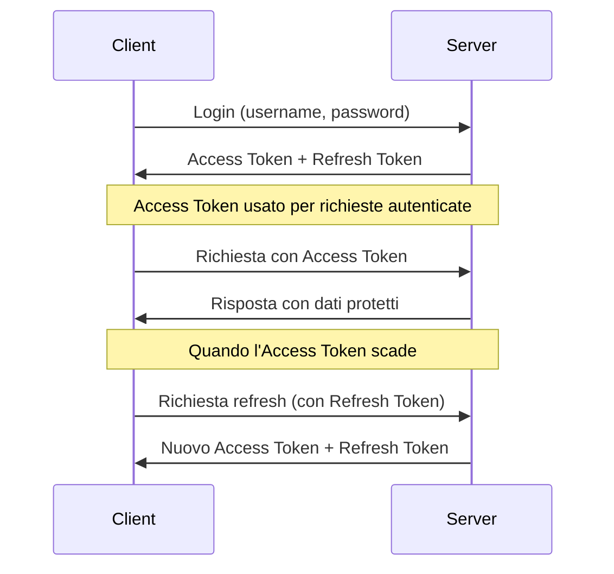

# Sistema di Autenticazione e Permessi - Guida Sviluppatori

Questa guida descrive l'architettura e l'implementazione del sistema di autenticazione e permessi in au-to-be-node, fornendo dettagli su come è progettato e come utilizzarlo correttamente quando si sviluppano nuove funzionalità.

## 1. Panoramica dell'Architettura

Il sistema di autenticazione e gestione permessi è basato su:

- **JSON Web Token (JWT)** per l'autenticazione stateless
- **Passport.js** per la verifica dei token
- **CASL** per l'implementazione del sistema di permessi granulari
- **Role-Based Access Control (RBAC)** esteso con permessi condizionali
- **Permessi Individuali** per gestire eccezioni e casi speciali

L'architettura tiene conto del sistema multi-tenant, garantendo un corretto isolamento tra tenant diversi.

## 2. Autenticazione Utenti

### 2.1 Ciclo di Vita del Token

Il sistema implementa uno schema di autenticazione JWT basato su due token:

1. **Access Token**: Breve durata (15 minuti predefiniti), utilizzato per le richieste API
2. **Refresh Token**: Lunga durata (7 giorni predefiniti), utilizzato per generare nuovi access token



### 2.2 Implementazione

Il sistema è implementato attraverso diversi componenti:

- **jwtService**: Service che gestisce la generazione e verifica dei token JWT
- **passport.js**: Configurato con strategia JWT per autenticare richieste
- **authMiddleware**: Middleware che protegge le rotte che richiedono autenticazione
- **authController**: Controller che gestisce login, logout e refresh token

### 2.3 Ruoli e Utenti

Gli utenti hanno relazioni molti-a-molti con i ruoli. Ogni ruolo ha un insieme di "abilities" che determinano i permessi.

```javascript
// Esempio di accesso ai ruoli di un utente
const userRoles = await user.getRoles();
```

### 2.4 Protezione delle Rotte

Le rotte API che richiedono autenticazione sono protette dal middleware `authenticate`:

```javascript
router.get('/protected-route', 
    authenticate,  // Richiede un token JWT valido
    yourController.method
);
```

### 2.5 Gestione Login/Logout

```javascript
// Login
// POST /api/auth/login
{
    "username": "your_username",  // può essere anche l'email
    "password": "your_password"
}

// Risposta
{
    "status": "success",
    "message": "Login effettuato con successo",
    "data": {
        "user": { /* dettagli utente */ },
        "accessToken": "...",
        "refreshToken": "...",
        "expires": "2023-12-31T12:00:00.000Z"
    }
}
```

## 3. Sistema di Permessi (CASL)

### 3.1 Concetti Principali

Il sistema utilizza CASL per implementare il controllo degli accessi:

- **Abilities**: Definiscono cosa un utente può fare su una specifica risorsa
- **Action**: Cosa l'utente può fare (create, read, update, delete, manage)
- **Subject**: Su quale modello o risorsa l'utente può eseguire l'azione
- **Conditions**: Condizioni per limitare l'azione a specifici record
- **Fields**: Campi specifici su cui l'azione è permessa

### 3.2 CASL e Middleware

Il sistema implementa:

- **abilityService**: Costruisce un oggetto `Ability` di CASL per ogni utente
- **permissionMiddleware**: Verifica i permessi prima di eseguire un'azione
- **Classi Policy**: Implementano la logica di autorizzazione per ogni modello

### 3.3 Utilizzo del Middleware di Permessi

```javascript
router.get('/resources',
    authenticate,  // Prima verifica l'autenticazione
    checkPermission('read', 'Resource'),  // Poi verifica il permesso
    resourceController.getAll
);

// Esempio con permesso condizionale su singola risorsa
router.get('/resources/:id',
    authenticate,
    async (req, res, next) => {
        // Il middleware risolve dinamicamente il soggetto
        const subjectResolver = async () => {
            const resource = await Resource.findByPk(req.params.id);
            return resource;
        };
        checkPermission('read', subjectResolver)(req, res, next);
    },
    resourceController.getById
);
```

### 3.4 Filtraggio Dati Basato su Permessi

Il middleware `filterByPermission` filtra automaticamente i risultati:

```javascript
router.get('/resources',
    authenticate,
    filterByPermission('read', 'Resource'),  // Filtra i risultati in base ai permessi
    async (req, res, next) => {
        // req.queryOptions contiene già le condizioni di filtraggio
        const resources = await Resource.findAll(req.queryOptions);
        res.json({ data: resources });
    }
);
```

## 4. Permessi Individuali

### 4.1 Concetto e Architettura

I permessi individuali consentono di assegnare capacità specifiche direttamente agli utenti, indipendentemente dai loro ruoli. Questo sistema estende il RBAC standard con eccezioni per casi specifici.

Caratteristiche principali:
- **Granularità**: Permessi specifici per utenti individuali
- **Priorità**: I permessi individuali hanno priorità sui permessi di ruolo
- **Temporaneità**: Possono avere una data di scadenza
- **Tracciabilità**: Registrano chi ha creato il permesso e perché

### 4.2 Modello Dati

Il sistema utilizza il modello `UserAbility` per memorizzare i permessi individuali:

```javascript
UserAbility.init({
  id: {
    type: DataTypes.UUID,
    defaultValue: DataTypes.UUIDV4,
    primaryKey: true
  },
  user_id: {
    type: DataTypes.UUID,
    allowNull: false,
    // riferimento all'utente
  },
  action: {
    type: DataTypes.STRING,
    allowNull: false,
    // create, read, update, delete, manage
  },
  subject: {
    type: DataTypes.STRING,
    allowNull: false,
    // modello o entità su cui si applica l'azione
  },
  conditions: {
    type: DataTypes.JSONB,
    allowNull: true,
    // condizioni che limitano il permesso a specifici record
  },
  fields: {
    type: DataTypes.ARRAY(DataTypes.STRING),
    allowNull: true,
    // campi specifici a cui si applica il permesso
  },
  inverted: {
    type: DataTypes.BOOLEAN,
    defaultValue: false,
    // se true, nega il permesso invece di concederlo
  },
  priority: {
    type: DataTypes.INTEGER,
    defaultValue: 10,
    // priorità del permesso (più alto ha precedenza)
  },
  reason: {
    type: DataTypes.STRING,
    allowNull: true,
    // motivo dell'assegnazione
  },
  expires_at: {
    type: DataTypes.DATE,
    allowNull: true,
    // data di scadenza opzionale
  }
  // altri campi...
});
```

### 4.3 Integrazione con il Sistema Esistente

I permessi individuali sono integrati con il sistema di autorizzazione esistente:

1. L'`abilityService` carica sia le abilities basate su ruolo che quelle individuali
2. Le abilities vengono ordinate per priorità (quelle individuali hanno tipicamente priorità maggiore)
3. CASL applica tutte le regole, risolvendo automaticamente i conflitti
4. Le policy e i middleware esistenti funzionano senza modifiche

### 4.4 API per Gestire i Permessi Individuali

#### Rotte principali:
```javascript
// Ottenere tutti i permessi individuali di un utente
GET /api/users/:userId/abilities

// Ottenere un permesso individuale specifico
GET /api/users/:userId/abilities/:abilityId

// Creare un nuovo permesso individuale
POST /api/users/:userId/abilities

// Aggiornare un permesso individuale
PUT /api/users/:userId/abilities/:abilityId

// Eliminare un permesso individuale
DELETE /api/users/:userId/abilities/:abilityId

// Ottenere un riassunto di tutti i permessi effettivi di un utente
GET /api/users/:userId/effective-abilities
```

#### Esempio di creazione di un permesso individuale:
```javascript
// POST /api/users/:userId/abilities
{
  "action": "update",
  "subject": "Filiale",
  "conditions": { "id": "filiale-specifica-uuid" },
  "reason": "Sostituzione temporanea responsabile",
  "expiresAt": "2023-12-31T23:59:59.999Z",
  "priority": 10
}
```

### 4.5 Esempi di Utilizzo

Ecco alcuni scenari in cui i permessi individuali risultano utili:

#### Esempio 1: Autorizzazione Temporanea
Consente a un Responsabile Filiale di gestire un'altra filiale temporaneamente:

```javascript
// Permesso per gestire una filiale specifica
{
  action: "update",
  subject: "Filiale",
  conditions: { id: "filiale-b-uuid" },
  reason: "Sostituzione temporanea Responsabile Filiale B",
  expiresAt: "2025-06-01T00:00:00.000Z"
}
```

#### Esempio 2: Accesso Granulare a Risorse Multiple
Permette a un tecnico di vedere asset di filiali diverse:

```javascript
{
  action: "read",
  subject: "Asset",
  conditions: { 
    filiale_id: { $in: ["filiale-a-uuid", "filiale-b-uuid"] } 
  },
  reason: "Progetto inventario multi-filiale"
}
```

#### Esempio 3: Negazione Specifica
Impedisce a un Amministratore di Sistema di eliminare utenti:

```javascript
{
  action: "delete",
  subject: "User",
  inverted: true, // Nega il permesso
  priority: 20    // Priorità alta per sovrascrivere i permessi di ruolo
}
```

#### Esempio 4: Limitazione per Campo
Permette di aggiornare solo determinati campi di un'entità:

```javascript
{
  action: "update",
  subject: "Asset",
  conditions: { filiale_id: "filiale-utente-uuid" },
  fields: ["data_ultima_manutenzione", "data_prossima_manutenzione"],
  reason: "Limitazione ai soli campi di manutenzione"
}
```

### 4.6 Considerazioni di Sicurezza

1. **Audit Trail**: Ogni permesso individuale traccia chi lo ha creato, quando e perché
2. **Pulizia Automatica**: I permessi con scadenza vengono automaticamente ignorati dopo la data di scadenza
3. **Limitazioni**: Solo gli Amministratori di Sistema possono gestire i permessi individuali
4. **Priorità**: Il sistema di priorità permette di gestire correttamente i conflitti tra permessi

## 5. Ruoli Predefiniti

Il sistema include i seguenti ruoli predefiniti:

### 5.1 Amministratore di Sistema
- Accesso completo a tutto il sistema
- Può gestire utenti, ruoli, e tutte le risorse
- Può gestire permessi individuali

### 5.2 Ufficio Tecnico
- Supervisione e amministrazione tecnica
- Gestione completa degli asset e delle locations
- Creazione e modifica utenti
- Lettura ruoli

### 5.3 Ufficio Post Vendita
- Lettura completa di asset e locations
- Modifica degli asset
- Lettura degli utenti

### 5.4 Area Manager
- Gestione delle filiali nella propria area
- Lettura e modifica asset nella propria area
- Lettura utenti nella propria area

### 5.5 Responsabile Filiale
- Gestione operativa della propria filiale
- Gestione completa degli asset nella propria filiale
- Lettura asset di altre filiali
- Gestione fornitori

### 5.6 Responsabile Officina e Service
- Gestione attrezzature della propria officina
- Lettura asset di altre filiali
- Gestione fornitori

### 5.7 Magazzino
- Gestione inventario (lettura e aggiornamento)
- Funzionalità limitate agli asset della propria filiale

## 6. Implementazione delle Policy

### 6.1 Struttura delle Policy

Le policy definiscono la logica di autorizzazione per ciascun modello:

```javascript
// BasePolicy fornisce metodi comuni
class BasePolicy {
    async canCreate(user, data) { /* ... */ }
    async canRead(user, instance) { /* ... */ }
    async canUpdate(user, instance, data) { /* ... */ }
    async canDelete(user, instance) { /* ... */ }
}

// Esempio di policy specifica
class UserPolicy extends BasePolicy {
    constructor() {
        super('User');
    }
    
    async canUpdate(user, targetUser, data) {
        // Verifica di base dalla classe padre
        const baseCanUpdate = await super.canUpdate(user, targetUser);
        if (!baseCanUpdate) return false;
        
        // Logica specifica della policy
        // Un utente può sempre modificare il proprio profilo
        if (user.id === targetUser.id) return true;
        
        // Verifica multi-tenant
        if (targetUser.tenant_id !== user.tenant_id) return false;
        
        // Solo admin possono modificare altri admin
        if (targetUser.hasRole('Amministratore di Sistema') && 
            !user.hasRole('Amministratore di Sistema')) return false;
            
        // Altre regole...
        
        return true;
    }
}
```

### 6.2 Utilizzo delle Policy nei Controller

```javascript
const policy = require('../policies/UserPolicy');

const updateUser = async (req, res, next) => {
    const user = await User.findByPk(req.params.id);
    if (!user) return next(AppError.notFound('Utente non trovato'));
    
    // Verifica autorizzazione
    const canUpdate = await policy.canUpdate(req.user, user, req.body);
    if (!canUpdate) {
        return next(AppError.authorization('Non autorizzato'));
    }
    
    // Procedi con l'aggiornamento...
};
```

## 7. Come Estendere il Sistema

### 7.1 Aggiungere una Nuova Route Protetta

```javascript
// Nei controller
const myProtectedMethod = async (req, res, next) => {
    try {
        // req.user contiene l'utente autenticato
        // Logica controller...
    } catch (error) {
        next(error);
    }
};

// Nelle routes
router.post('/resource',
    authenticate,
    checkPermission('create', 'Resource'),
    controller.myProtectedMethod
);
```

### 7.2 Implementare una Policy per un Nuovo Modello

```javascript
// 1. Crea un file policy/ResourcePolicy.js
const BasePolicy = require('./BasePolicy');

class ResourcePolicy extends BasePolicy {
    constructor() {
        super('Resource');
    }
    
    async canCreate(user, data) {
        const baseCanCreate = await super.canCreate(user, data);
        if (!baseCanCreate) return false;
        
        // Regole personalizzate...
        return true;
    }
    
    // Implementa altri metodi...
}

module.exports = new ResourcePolicy();

// 2. Utilizza la policy nei controller
const policy = require('../policies/ResourcePolicy');

// 3. Verifica i permessi
const canCreate = await policy.canCreate(req.user, req.body);
```

### 7.3 Creare un Permesso Individuale

Per creare un permesso individuale:

```javascript
// Usando l'API
const createPermission = async (userId, permissionData) => {
  const response = await fetch(`/api/users/${userId}/abilities`, {
    method: 'POST',
    headers: {
      'Content-Type': 'application/json',
      'Authorization': `Bearer ${accessToken}`
    },
    body: JSON.stringify(permissionData)
  });
  
  return response.json();
};

// Esempio di permissione temporanea
const tempPermission = {
  action: 'update',
  subject: 'Filiale',
  conditions: { id: 'filiale-123' },
  reason: 'Sostituzione temporanea',
  expiresAt: '2025-05-01T00:00:00.000Z'
};

createPermission('user-456', tempPermission);
```

### 7.4 Estendere le Funzionalità dei Permessi Individuali

Se si desidera estendere il sistema di permessi individuali, è possibile:

1. Aggiungere nuovi campi al modello `UserAbility`
2. Estendere il controller `userAbilityController` con nuove funzionalità
3. Modificare l'`abilityService` per considerare i nuovi campi/funzionalità

## 8. Risoluzione Problemi Comuni

### 8.1 Token Invalid o Expired

Possibili cause:
- Token scaduto: Il client deve usare il refresh token
- Secret errato: Verifica le variabili d'ambiente JWT_SECRET
- Token manipolato: Potenziale tentativo di attacco

### 8.2 Permesso Negato Inaspettatamente

Debugging:
- Verifica i ruoli dell'utente: `console.log(user.roles)`
- Controlla le abilities generate: utilizzare il logger di debug in `abilityService`
- Verifica le condizioni nelle policy: aggiungi log nelle policy specifiche
- Controlla se ci sono permessi individuali in conflitto: usa `GET /api/users/:userId/effective-abilities`

### 8.3 Problemi con Filtraggio Multi-Tenant

- Verifica che le query includano sempre il corretto `tenant_id`
- Controlla la corretta propagazione di `req.tenantId` attraverso i middleware
- Verifica che le policy controllino il tenant_id delle risorse

### 8.4 Permessi Individuali Non Applicati

Se i permessi individuali non vengono applicati correttamente:

1. Verifica che il permesso non sia scaduto (`expires_at`)
2. Controlla che la priorità sia sufficientemente alta
3. Verifica che l'azione e il soggetto corrispondano esattamente
4. Usa `GET /api/users/:userId/effective-abilities` per vedere tutti i permessi dell'utente

## 9. Best Practices

1. **Usa sempre il middleware `authenticate`** per proteggere le route
2. **Implementa policy specifiche** per modelli con logica di autorizzazione complessa
3. **Applica il middleware `checkPermission`** dopo `authenticate` per verificare i permessi
4. **Verifica esplicitamente i permessi nei controller** usando le policy
5. **Utilizza i permessi individuali con moderazione** per evitare di complicare la gestione delle autorizzazioni
6. **Imposta sempre una data di scadenza** per i permessi individuali temporanei
7. **Documenta i motivi** dell'assegnazione di permessi individuali nel campo `reason`

Per maggiori dettagli implementativi, fare riferimento ai sorgenti:
- `src/middleware/authMiddleware.js`
- `src/middleware/permissionMiddleware.js`
- `src/services/abilityService.js`
- `src/services/jwtService.js`
- `src/policies/BasePolicy.js`
- `src/models/user-ability.js`
- `src/api/controllers/userAbilityController.js`