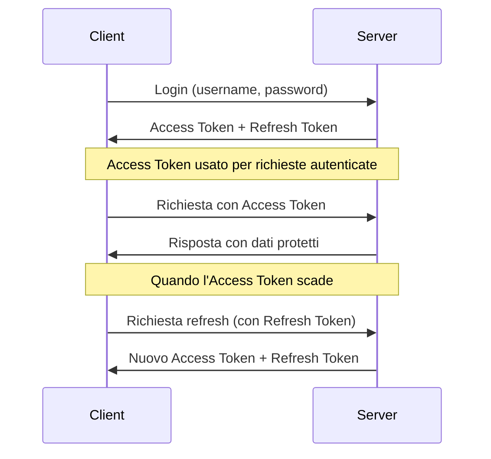

# Sistema di Autenticazione e Permessi - Guida Sviluppatori

Questa guida descrive l'architettura e l'implementazione del sistema di autenticazione e permessi in au-to-be-node, fornendo dettagli su come è progettato e come utilizzarlo correttamente quando si sviluppano nuove funzionalità.

## 1. Panoramica dell'Architettura

Il sistema di autenticazione e gestione permessi è basato su:

- **JSON Web Token (JWT)** per l'autenticazione stateless
- **Passport.js** per la verifica dei token
- **CASL** per l'implementazione del sistema di permessi granulari
- **Role-Based Access Control (RBAC)** esteso con permessi condizionali

L'architettura tiene conto del sistema multi-tenant, garantendo un corretto isolamento tra tenant diversi.

## 2. Autenticazione Utenti

### 2.1 Ciclo di Vita del Token

Il sistema implementa uno schema di autenticazione JWT basato su due token:

1. **Access Token**: Breve durata (15 minuti predefiniti), utilizzato per le richieste API
2. **Refresh Token**: Lunga durata (7 giorni predefiniti), utilizzato per generare nuovi access token



### 2.2 Implementazione

Il sistema è implementato attraverso diversi componenti:

- **jwtService**: Service che gestisce la generazione e verifica dei token JWT
- **passport.js**: Configurato con strategia JWT per autenticare richieste
- **authMiddleware**: Middleware che protegge le rotte che richiedono autenticazione
- **authController**: Controller che gestisce login, logout e refresh token

### 2.3 Ruoli e Utenti

Gli utenti hanno relazioni molti-a-molti con i ruoli. Ogni ruolo ha un insieme di "abilities" che determinano i permessi.

```javascript
// Esempio di accesso ai ruoli di un utente
const userRoles = await user.getRoles();
```

### 2.4 Protezione delle Rotte

Le rotte API che richiedono autenticazione sono protette dal middleware `authenticate`:

```javascript
router.get('/protected-route', 
    authenticate,  // Richiede un token JWT valido
    yourController.method
);
```

### 2.5 Gestione Login/Logout

```javascript
// Login
// POST /api/auth/login
{
    "username": "your_username",  // può essere anche l'email
    "password": "your_password"
}

// Risposta
{
    "status": "success",
    "message": "Login effettuato con successo",
    "data": {
        "user": { /* dettagli utente */ },
        "accessToken": "...",
        "refreshToken": "...",
        "expires": "2023-12-31T12:00:00.000Z"
    }
}
```

## 3. Sistema di Permessi (CASL)

### 3.1 Concetti Principali

Il sistema utilizza CASL per implementare il controllo degli accessi:

- **Abilities**: Definiscono cosa un utente può fare su una specifica risorsa
- **Action**: Cosa l'utente può fare (create, read, update, delete, manage)
- **Subject**: Su quale modello o risorsa l'utente può eseguire l'azione
- **Conditions**: Condizioni per limitare l'azione a specifici record
- **Fields**: Campi specifici su cui l'azione è permessa

### 3.2 CASL e Middleware

Il sistema implementa:

- **abilityService**: Costruisce un oggetto `Ability` di CASL per ogni utente
- **permissionMiddleware**: Verifica i permessi prima di eseguire un'azione
- **Classi Policy**: Implementano la logica di autorizzazione per ogni modello

### 3.3 Utilizzo del Middleware di Permessi

```javascript
router.get('/resources',
    authenticate,  // Prima verifica l'autenticazione
    checkPermission('read', 'Resource'),  // Poi verifica il permesso
    resourceController.getAll
);

// Esempio con permesso condizionale su singola risorsa
router.get('/resources/:id',
    authenticate,
    async (req, res, next) => {
        // Il middleware risolve dinamicamente il soggetto
        const subjectResolver = async () => {
            const resource = await Resource.findByPk(req.params.id);
            return resource;
        };
        checkPermission('read', subjectResolver)(req, res, next);
    },
    resourceController.getById
);
```

### 3.4 Filtraggio Dati Basato su Permessi

Il middleware `filterByPermission` filtra automaticamente i risultati:

```javascript
router.get('/resources',
    authenticate,
    filterByPermission('read', 'Resource'),  // Filtra i risultati in base ai permessi
    async (req, res, next) => {
        // req.queryOptions contiene già le condizioni di filtraggio
        const resources = await Resource.findAll(req.queryOptions);
        res.json({ data: resources });
    }
);
```

## 4. Ruoli Predefiniti

Il sistema include i seguenti ruoli predefiniti:

### 4.1 Amministratore di Sistema
- Accesso completo a tutto il sistema
- Può gestire utenti, ruoli, e tutte le risorse

### 4.2 Ufficio Tecnico
- Supervisione e amministrazione tecnica
- Gestione completa degli asset e delle locations
- Creazione e modifica utenti
- Lettura ruoli

### 4.3 Ufficio Post Vendita
- Lettura completa di asset e locations
- Modifica degli asset
- Lettura degli utenti

### 4.4 Area Manager
- Gestione delle filiali nella propria area
- Lettura e modifica asset nella propria area
- Lettura utenti nella propria area

### 4.5 Responsabile Filiale
- Gestione operativa della propria filiale
- Gestione completa degli asset nella propria filiale
- Lettura asset di altre filiali
- Gestione fornitori

### 4.6 Responsabile Officina e Service
- Gestione attrezzature della propria officina
- Lettura asset di altre filiali
- Gestione fornitori

### 4.7 Magazzino
- Gestione inventario (lettura e aggiornamento)
- Funzionalità limitate agli asset della propria filiale

## 5. Implementazione delle Policy

### 5.1 Struttura delle Policy

Le policy definiscono la logica di autorizzazione per ciascun modello:

```javascript
// BasePolicy fornisce metodi comuni
class BasePolicy {
    async canCreate(user, data) { /* ... */ }
    async canRead(user, instance) { /* ... */ }
    async canUpdate(user, instance, data) { /* ... */ }
    async canDelete(user, instance) { /* ... */ }
}

// Esempio di policy specifica
class UserPolicy extends BasePolicy {
    constructor() {
        super('User');
    }
    
    async canUpdate(user, targetUser, data) {
        // Verifica di base dalla classe padre
        const baseCanUpdate = await super.canUpdate(user, targetUser);
        if (!baseCanUpdate) return false;
        
        // Logica specifica della policy
        // Un utente può sempre modificare il proprio profilo
        if (user.id === targetUser.id) return true;
        
        // Verifica multi-tenant
        if (targetUser.tenant_id !== user.tenant_id) return false;
        
        // Solo admin possono modificare altri admin
        if (targetUser.hasRole('Amministratore di Sistema') && 
            !user.hasRole('Amministratore di Sistema')) return false;
            
        // Altre regole...
        
        return true;
    }
}
```

### 5.2 Utilizzo delle Policy nei Controller

```javascript
const policy = require('../policies/UserPolicy');

const updateUser = async (req, res, next) => {
    const user = await User.findByPk(req.params.id);
    if (!user) return next(AppError.notFound('Utente non trovato'));
    
    // Verifica autorizzazione
    const canUpdate = await policy.canUpdate(req.user, user, req.body);
    if (!canUpdate) {
        return next(AppError.authorization('Non autorizzato'));
    }
    
    // Procedi con l'aggiornamento...
};
```

## 6. Come Estendere il Sistema

### 6.1 Aggiungere una Nuova Route Protetta

```javascript
// Nei controller
const myProtectedMethod = async (req, res, next) => {
    try {
        // req.user contiene l'utente autenticato
        // Logica controller...
    } catch (error) {
        next(error);
    }
};

// Nelle routes
router.post('/resource',
    authenticate,
    checkPermission('create', 'Resource'),
    controller.myProtectedMethod
);
```

### 6.2 Implementare una Policy per un Nuovo Modello

```javascript
// 1. Crea un file policy/ResourcePolicy.js
const BasePolicy = require('./BasePolicy');

class ResourcePolicy extends BasePolicy {
    constructor() {
        super('Resource');
    }
    
    async canCreate(user, data) {
        const baseCanCreate = await super.canCreate(user, data);
        if (!baseCanCreate) return false;
        
        // Regole personalizzate...
        return true;
    }
    
    // Implementa altri metodi...
}

module.exports = new ResourcePolicy();

// 2. Utilizza la policy nei controller
const policy = require('../policies/ResourcePolicy');

// 3. Verifica i permessi
const canCreate = await policy.canCreate(req.user, req.body);
```

### 6.3 Estendere il Service CASL per Nuovi Modelli

Quando si aggiunge un nuovo modello che richiede controllo di accesso:

1. Assicurarsi che sia referenziato nelle abilities dei ruoli nel `policyBuilder.js`
2. Implementare una policy dedicata se ha regole di accesso complesse
3. Aggiungere middleware di permessi alle route appropriate

## 7. Risoluzione Problemi Comuni

### 7.1 Token Invalid o Expired

Possibili cause:
- Token scaduto: Il client deve usare il refresh token
- Secret errato: Verifica le variabili d'ambiente JWT_SECRET
- Token manipolato: Potenziale tentativo di attacco

### 7.2 Permesso Negato Inaspettatamente

Debugging:
- Verifica i ruoli dell'utente: `console.log(user.roles)`
- Controlla le abilities generate: utilizzare il logger di debug in `abilityService`
- Verifica le condizioni nelle policy: aggiungi log nelle policy specifiche

### 7.3 Problemi con Filtraggio Multi-Tenant

- Verifica che le query includano sempre il corretto `tenant_id`
- Controlla la corretta propagazione di `req.tenantId` attraverso i middleware
- Verifica che le policy controllino il tenant_id delle risorse

## 8. Best Practices

1. **Usa sempre il middleware `authenticate`** per proteggere le route
2. **Implementa policy specifiche** per modelli con logica di autorizzazione complessa
3. **Applica il middleware `checkPermission`** dopo `authenticate` per verificare i permessi
4. **Verifica esplicitamente i permessi nei controller** usando le policy
5. **Mantieni i ruoli aggiornati** quando aggiungi nuove funzionalità

Per maggiori dettagli implementativi, fare riferimento ai sorgenti:
- `src/middleware/authMiddleware.js`
- `src/middleware/permissionMiddleware.js`
- `src/services/abilityService.js`
- `src/services/jwtService.js`
- `src/policies/BasePolicy.js`